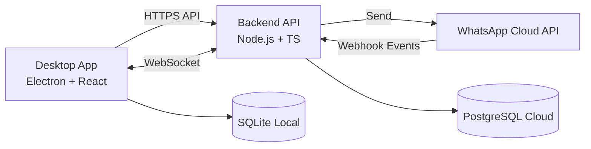

# WhatsApp Cloud Desktop App — Planning & Architecture Document

**Status:** Phase 3 Complete ✅ | Phase 4 Planning (Awaiting Approval)  
**Last Updated:** February 2, 2026

---

## 1) Project Overview & Goals (Non‑technical)

**Problem this product solves**
Businesses want a reliable desktop tool to message customers on WhatsApp, manage contacts, run campaigns, and handle incoming replies. Existing “automation tools” often rely on unsafe methods or break platform rules. This product provides a safe, long‑term solution.

**Target users**
- Small and medium businesses
- Support and sales teams
- Agencies managing multiple client accounts

**Desktop‑first approach**
Users install a desktop app on **Windows** or **macOS**. They don’t need to open a web dashboard. The app works locally for planning and drafts, and securely connects to the backend for sending and syncing.

**Why use the WhatsApp Business Cloud API**
It’s the **official Meta API**, supported long‑term, stable, and compliant. It provides secure messaging, webhooks for incoming messages, and official message templates.

**Compliance principles (non‑negotiable)**
- No WhatsApp Web automation
- No scraping
- No unofficial APIs
- Only opt‑in messaging and approved templates

---

## 2) Confirmed Architecture (High‑Level)

**Decisions confirmed**
- **Multi‑tenant backend (default)**
- **WebSocket for realtime**
- Offline drafts only (sending requires backend connectivity)
- Message storage designed for retention policies

**Desktop app**
- Electron + React + TypeScript
- Local SQLite for contacts, drafts, and cache

**Backend**
- Node.js + TypeScript
- WhatsApp Business Cloud API
- Webhook processing for inbound messages and status

**Realtime layer**
- WebSocket (chosen over SSE)

**Data ownership**
- **Local (SQLite):** user drafts, cached contacts, UI settings
- **Cloud (PostgreSQL):** campaigns, messages, statuses, inbox data, audits

### Simple Architecture Diagram



---

## 3) Data Flow Explanation (Plain Language)

### A) How a message is sent
1. The user creates a campaign in the **desktop app**.
2. The app sends the campaign details to the **backend API**.
3. The backend sends messages through the **WhatsApp Cloud API**.
4. WhatsApp returns **delivery status updates** (sent/delivered/read) via webhooks.
5. The backend stores these updates in the **cloud database** and pushes them to the desktop app in **realtime**.
6. The desktop app shows updated status in the **Inbox and Reports**.

### B) How incoming messages appear in Inbox
1. A customer sends a WhatsApp message.
2. WhatsApp Cloud API sends a **webhook event** to the backend.
3. The backend saves the message to the **cloud database** and pushes it to connected desktop apps via **WebSocket**.
4. The Inbox list updates with the new message, contact, and unread status.

### C) “Read” status difference
- **WhatsApp Read**: a receipt from Meta showing if the customer has read the message.
- **Agent Read**: whether a user (agent) has opened the conversation in the desktop app. This is stored separately.

### D) Offline behavior
- Users can **draft** messages and campaigns offline.
- Sending requires backend connectivity.
- Once online, drafts can be synced and sent.
- The desktop app shows a clear **“Offline/Pending”** state for any unsent drafts.

---

## 4) Feature Breakdown (Simple Language)

### A) Contacts
- **Import flow**: CSV/XLSX upload, map columns, preview, confirm.
- **Tags & custom fields**: store extra data like company, region, etc.
- **Duplicate rules**: normalize phone numbers; if number exists, update or skip based on user choice.
- **Implementation note**: CSV/XLSX parsing uses **ExcelJS** (replaces xlsx due to security advisories).

### B) Templates
- **Sync from Meta**: only approved templates appear.
- **Variable handling**: placeholders like `{{name}}` validated against contact fields.
- **Preview logic**: live preview shows how each contact will see the message.

### C) Campaigns
- **Creation flow**: select contacts/tags → choose template → schedule.
- **Scheduling**: run now or later.
- **Pause/resume**: stop safely without losing progress.
- **Rate limiting**: daily limits + delays to avoid spam flags.

### D) Media
- **Validation rules**: type and size checked before upload.
- **Upload flow**: desktop → backend → WhatsApp media endpoint.
- **Reuse logic**: media IDs cached for repeated sends.

### E) Inbox (Core Feature)
- **Conversation grouping**: all messages grouped by contact.
- **Message history**: full view of inbound/outbound messages.
- **Real‑time updates**: WebSocket pushes new messages instantly.
- **Manual replies**: send a reply from the desktop app.
- **Quick replies/templates**: insert approved templates quickly.
- **Read/unread logic**: **per‑agent** unread counters (not global). An unread count resets **only when that agent opens the conversation**.

### F) Automation
- **Keyword replies**: auto‑respond when a specific word is received.
- **Business hours**: out‑of‑office messages after hours.
- **Retry logic**: failed sends retried with backoff and limits.

### G) Reports
- **Campaign stats**: sent/delivered/read/failed.
- **Message funnel**: visual overview of delivery.
- **CSV export**: download reports for audits.

---

## 5) Database Design (Conceptual First)

### Why each table exists (plain language)
- **orgs**: separate tenants (each business).
- **users**: people who log in.
- **contacts**: recipients and their fields.
- **tags**: group contacts.
- **templates**: approved messages from Meta.
- **campaigns**: batches of outbound messages.
- **campaign_recipients**: who received what in a campaign.
- **messages**: each individual message (inbound/outbound).
- **message_status_events**: sent/delivered/read timeline.
- **conversations**: inbox threads by contact.
- **automation_rules**: keyword and hours rules.
- **opt_in_events**: proof of consent.
- **audit_logs**: security and compliance tracking.

### Relationships (high‑level)
- org → users → campaigns → messages
- org → contacts → conversations → messages
- campaigns → campaign_recipients → messages

### Message storage rules
- All inbound/outbound messages stored with timestamps, status, and channel metadata.
- WhatsApp message IDs kept for reconciliation.

### Retention‑ready design
- Each message has `retention_policy` and `deleted_at` fields to support future deletion policies and legal compliance.
- **Default behavior (Phase 1):** store messages indefinitely unless manually deleted. Retention policies are **inactive by default** but schema is ready.

---

## PostgreSQL Schema (Draft)

```sql
CREATE TABLE orgs (
  id UUID PRIMARY KEY,
  name TEXT NOT NULL,
  created_at TIMESTAMP NOT NULL DEFAULT now()
);

CREATE TABLE users (
  id UUID PRIMARY KEY,
  org_id UUID NOT NULL REFERENCES orgs(id),
  email TEXT UNIQUE NOT NULL,
  password_hash TEXT NOT NULL,
  role TEXT NOT NULL,
  created_at TIMESTAMP NOT NULL DEFAULT now()
);

CREATE TABLE contacts (
  id UUID PRIMARY KEY,
  org_id UUID NOT NULL REFERENCES orgs(id),
  phone_e164 TEXT NOT NULL,
  name TEXT,
  custom_fields JSONB,
  created_at TIMESTAMP NOT NULL DEFAULT now(),
  UNIQUE (org_id, phone_e164)
);

CREATE TABLE contact_tags (
  contact_id UUID REFERENCES contacts(id),
  tag TEXT NOT NULL,
  PRIMARY KEY (contact_id, tag)
);

CREATE TABLE templates (
  id UUID PRIMARY KEY,
  org_id UUID NOT NULL REFERENCES orgs(id),
  meta_template_id TEXT NOT NULL,
  name TEXT NOT NULL,
  language TEXT NOT NULL,
  category TEXT NOT NULL,
  components JSONB NOT NULL,
  status TEXT NOT NULL,
  updated_at TIMESTAMP NOT NULL DEFAULT now()
);

CREATE TABLE campaigns (
  id UUID PRIMARY KEY,
  org_id UUID NOT NULL REFERENCES orgs(id),
  name TEXT NOT NULL,
  template_id UUID REFERENCES templates(id),
  scheduled_at TIMESTAMP,
  status TEXT NOT NULL,
  created_at TIMESTAMP NOT NULL DEFAULT now()
);

CREATE TABLE campaign_recipients (
  id UUID PRIMARY KEY,
  campaign_id UUID NOT NULL REFERENCES campaigns(id),
  contact_id UUID NOT NULL REFERENCES contacts(id),
  status TEXT NOT NULL,
  created_at TIMESTAMP NOT NULL DEFAULT now()
);

CREATE TABLE conversations (
  id UUID PRIMARY KEY,
  org_id UUID NOT NULL REFERENCES orgs(id),
  contact_id UUID NOT NULL REFERENCES contacts(id),
  last_message_at TIMESTAMP,
  unread_count INT NOT NULL DEFAULT 0
);

CREATE TABLE messages (
  id UUID PRIMARY KEY,
  org_id UUID NOT NULL REFERENCES orgs(id),
  conversation_id UUID REFERENCES conversations(id),
  contact_id UUID REFERENCES contacts(id),
  direction TEXT NOT NULL, -- inbound/outbound
  body TEXT,
  media_url TEXT,
  meta_message_id TEXT,
  status TEXT NOT NULL, -- sent/delivered/read/failed
  retention_policy TEXT,
  deleted_at TIMESTAMP,
  created_at TIMESTAMP NOT NULL DEFAULT now()
);

CREATE TABLE message_status_events (
  id UUID PRIMARY KEY,
  message_id UUID REFERENCES messages(id),
  status TEXT NOT NULL,
  timestamp TIMESTAMP NOT NULL DEFAULT now()
);

CREATE TABLE automation_rules (
  id UUID PRIMARY KEY,
  org_id UUID NOT NULL REFERENCES orgs(id),
  rule_type TEXT NOT NULL, -- keyword / business_hours
  config JSONB NOT NULL,
  is_active BOOLEAN NOT NULL DEFAULT true
);

CREATE TABLE opt_in_events (
  id UUID PRIMARY KEY,
  org_id UUID NOT NULL REFERENCES orgs(id),
  contact_id UUID NOT NULL REFERENCES contacts(id),
  source TEXT NOT NULL,
  timestamp TIMESTAMP NOT NULL DEFAULT now()
);

CREATE TABLE audit_logs (
  id UUID PRIMARY KEY,
  org_id UUID NOT NULL REFERENCES orgs(id),
  user_id UUID REFERENCES users(id),
  action TEXT NOT NULL,
  metadata JSONB,
  timestamp TIMESTAMP NOT NULL DEFAULT now()
);
```

---

## Local SQLite Schema (Subset)

```sql
CREATE TABLE local_contacts (
  id TEXT PRIMARY KEY,
  phone_e164 TEXT NOT NULL,
  name TEXT,
  custom_fields TEXT
);

CREATE TABLE local_drafts (
  id TEXT PRIMARY KEY,
  contact_id TEXT,
  body TEXT,
  updated_at TEXT
);

CREATE TABLE local_settings (
  key TEXT PRIMARY KEY,
  value TEXT
);
```

---

## 6) API Design (Human‑Readable First)

### API Groups (plain language)
- **Auth**: login, refresh token.
- **Contacts**: import and manage recipients.
- **Templates**: view approved templates from Meta.
- **Campaigns**: create, schedule, pause, resume.
- **Messages**: send single replies or manual outbound.
- **Inbox**: load conversations and messages.
- **Automation**: rules setup.
- **Reports**: stats and exports.
- **Webhooks**: receives WhatsApp events.

### Who calls what
- **Desktop App**: all user actions.
- **WhatsApp Webhooks**: inbound and status events.
- **System Jobs**: scheduling, retries.

---

## OpenAPI (Draft, minimal)

```yaml
openapi: 3.0.3
info:
  title: WhatsApp Desktop Backend API
  version: 0.1.0
servers:
  - url: https://api.example.com
paths:
  /auth/login:
    post:
      summary: Login
      requestBody:
        required: true
        content:
          application/json:
            schema:
              type: object
              properties:
                email: { type: string }
                password: { type: string }
      responses:
        "200": { description: OK }

  /contacts/import:
    post:
      summary: Import contacts CSV/XLSX
      responses:
        "200": { description: OK }

  /templates:
    get:
      summary: List approved templates
      responses:
        "200": { description: OK }

  /campaigns:
    post:
      summary: Create campaign
      responses:
        "200": { description: OK }

  /campaigns/{id}/schedule:
    post:
      summary: Schedule campaign
      parameters:
        - name: id
          in: path
          required: true
          schema: { type: string }
      responses:
        "200": { description: OK }

  /conversations:
    get:
      summary: List conversations
      responses:
        "200": { description: OK }

  /conversations/{id}/messages:
    get:
      summary: Get conversation messages
      parameters:
        - name: id
          in: path
          required: true
          schema: { type: string }
      responses:
        "200": { description: OK }

  /conversations/{id}/reply:
    post:
      summary: Send reply message
      parameters:
        - name: id
          in: path
          required: true
          schema: { type: string }
      responses:
        "200": { description: OK }

  /webhooks/whatsapp:
    post:
      summary: Receive WhatsApp webhook
      responses:
        "200": { description: OK }
```

---

## 7) Security & Compliance Documentation

- **Opt‑in enforcement**: outbound messages require opt‑in record.
- **STOP/unsubscribe**: keyword auto‑removes opt‑in and blocks future sends.
- **Throttling**: per‑org daily cap, per‑number delays.
- **Audit logging**: all sends, edits, and admin actions logged.
- **Secret management**: API keys stored server‑side only (vault or env vars).

---

## 8) Packaging & Distribution

- **Windows**: Electron Builder → NSIS .exe installer
- **macOS**: Electron Builder → .dmg + notarization
- **Auto‑update**: update server + signed releases
- **Versioning**: SemVer (major.minor.patch)

---

## 9) Delivery Phases & Milestones

### Phase 1 — Core Messaging + Contacts ✅ COMPLETE
**Includes:** contact import, templates sync, single send, opt‑in rules  
**Completed:** Auth, contacts CRUD, template sync, single-send pipeline, webhook status updates  
**Acceptance:** ✅ Send a template to a list and receive delivery status

### Phase 2 — Campaigns + Scheduler ✅ COMPLETE
**Includes:** campaigns, schedule, pause/resume, rate limiting  
**Completed:** Campaign creation UI, scheduler with queue worker, rate limiting (100 msg/sec), pause/resume flows  
**Acceptance:** ✅ Scheduled campaign executes with daily limits

### Phase 3 — Inbox + Automation ✅ COMPLETE
**Includes:** inbox view, WebSocket updates, manual replies, keyword automation, business hours  
**Completed:**
- Phase 3.1: Inbox data model + 21 API endpoints
- Phase 3.2: WebSocket real-time updates
- Phase 3.3: Desktop manual reply UI (4 components)
- Phase 3.4: Automation engine (keyword triggers, rate limiting, priority-based rules)
- Phase 3.5: Business hours + out-of-hours automation (timezone-aware)  
**Acceptance:** ✅ Inbound message appears in inbox within 2 seconds, automation triggers correctly

### Phase 4 — Reports, Packaging & Installers 📋 PLANNING (Awaiting Approval)
**Includes:** campaign reports, inbox analytics, CSV export, audit logs, Windows/macOS installers, auto-update  
**Plan:** See [PHASE-4-PLAN.md](PHASE-4-PLAN.md) for detailed milestone breakdown  
**Estimated Duration:** 16 working days  
**Acceptance:** Exportable reports with accurate delivery funnel, signed installers for Windows/macOS

---

## 10) Final Outputs Before Coding

Deliverables in this document:
- Planning & architecture document (this file)
- Architecture diagram
- Data flow explanation
- Feature explanations
- DB schema drafts
- API surface explanation + OpenAPI draft
- Delivery phases

### Development backlog with estimates (initial)
- Setup repo + CI + linting (3 days)
- Auth + org/user models (4 days)
- Contacts import + tagging (6 days)
- Templates sync + preview (5 days)
- Single send pipeline (5 days)
- Scheduler + rate limiter (7 days)
- Campaign manager UI (7 days)
- Inbox module + WebSocket (10 days)
- Automation rules (6 days)
- Reports + CSV export (5 days)
- Packaging + auto update (5 days)
- QA + compliance checks (8 days)

**Total initial estimate:** ~71 working days (first production‑ready release)

---

## Review Checklist
- [ ] Confirm scope is correct
- [ ] Confirm schema and API coverage
- [ ] Confirm compliance rules
- [ ] Approve to proceed with implementation
